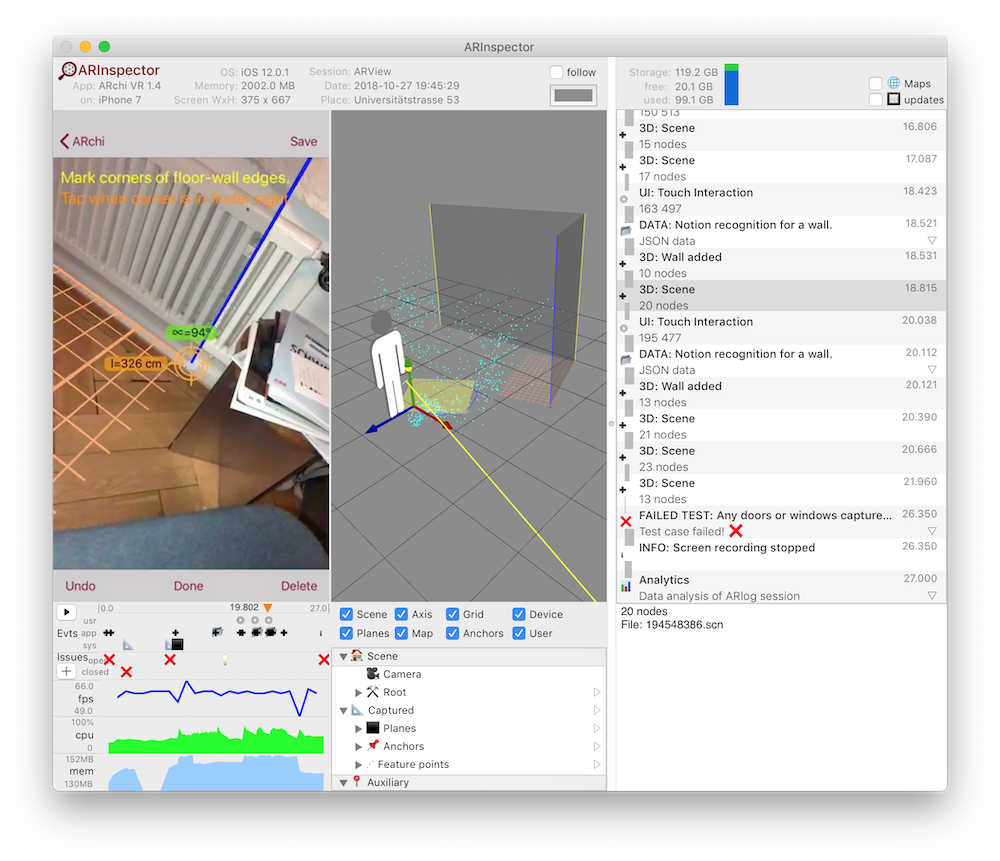

# ARlog: 
# Post-hoc Inspecting of AR Apps

## Challenges in Testing Augmented Reality Apps
Testing and debugging AR applications is quite tricky and time-consuming because 
* simulators do not provide world capturing through camera, therefore 
* you have to run tests of AR apps on real devices (e.g., on mobile devices or AR glasses);
* walking around with your smartphone or tablet moves your focus away from the console output of your IDE (wheather handicapped by a USB cable or free moving wirelessly doesn't really matter);  
* wearing an AR display on your head while testing code makes testing not easier;
* due to constant change in the real world (light conditions, device position & movement) test results in AR apps are not reproducable (e.g., recognized features are never the same between sessions),
* therefore automatic testing (e.g., with unit tests) is not possible,
* this puts pressure on application testing, but  
* studying user behavior and user experiences during usability tests is hardly possible without mirroring the screen  


## ARlog for AR Session Logging and Screen Recording
ARlog provides the functionality for post-hoc inspecting of AR applications by logging what is going on at runtime in your AR program. During an AR session low-level events of the ARKit framework are automatically collected and the screen is recorded as video. 
### ARlog for ARKit 
ARlog is easy to integrate into existing projects based on ARKit. To install ARlog follow these 3 steps: 
1. Add two files to your project
  * __ARlog.swift__
  * __ARlogItems.swift__
  2. Add one line of code in viewDidAppear of the ViewContoller to start ARlog. Add __ARlog.start()__ such as:
```
    override func viewDidAppear(_ animated: Bool) {
        super.viewDidAppear(animated)
        #if DEBUG
        ARlog.start() // <-- add
        #endif
    }
```
3. Add an additional line of code to stop ARlog. Add __ARlog.stop()__ in one of these cases:

If your AR app only shows an AR view, then stop logging in the AppDelegate with
```
    func applicationDidEnterBackground(_ application: UIApplication) {
        #if DEBUG
        ARlog.stop() // <-- add
        #endif
    }
```

If your app presents several views then stop logging when the AR view disappears. In the ViewContoller add:
```
    override func viewDidDisappear(_ animated: Bool) {
        super.viewDidDisappear(animated)
        #if DEBUG
        ARlog.stop() // <-- add
        #endif
    }
```
That's it! It already works and session logs of your AR app can post-hoc be analyzed. 

Use XCode to get access to the logged data on your device:
* Connect your device via USB cable to your Mac
* Then select the Window -> Devices and Simulators menu in XCode
* In the Devices tab select your app and then download the app container
* In the Finder right-click on the downloaded .xcappdata file and select Show Content

Each folder in AppData/Documents/ARlogs holds logged data of a specific session. The name of the session folder encodes the date and time when the log recording started. 


## ARInspector for AR Session Debugging and Usability Testing
Coming soon ...



### ARInspector for Mac 
The __ARInspector__ app supports the analysis of AR sessions logged by ARlog. The main features of ARInspector are:
* Play back of logged sessions in real-time or step-by-step
* Charts for CPU usage, memory usage and graphics performance (in fps, frames per second)
* See screen recording as video
* 3D visualization of the synthetic AR world
  * device position and orientation (with viewing direction of device camera)
  * position of the user
  * point cloud of captured feature points (WorldMap)
  * detected planes with their contour
  * anchor points
  * generated 3D geometry added by the app to the scene
* Tree view for inspecting the 3D scene graph
* Keep video and 3D view in sync (view in 3D what the device camera looked at) 
* List of events in a time-sorted table
* Detailed data on events in a console

## ARlog Functions
To enhance session logs with application-specific information, additional logging can be added programmatically in your code with the following functions.

    ARlog.info(_ str:String) 
    ARlog.debug(_ str:String) 
    ARlog.warning(_ str:String) 
    ARlog.severe(_ str:String) 
    ARlog.text(_ str:String, level:LogLevel = .debug, title:String = "Message") 
    ARlog.data(_ jsonStr:String, title:String = "Data") 
    ARlog.touch(_ at:CGPoint, long:Bool = false, title:String = "") 
    ARlog.scene(_ scene:SCNScene, title:String = "Scene")
    ARlog.map(_ map:ARWorldMap, title:String = "Map")
    
In order to turn off ARlog set ARLOG_ENABLED = false at the beginning of ARlog.swift.
If ARlog statements are embedded in  #if DEBUG conditions ARlog will not be linked to the productive release of your app. 

## Configure ARlog
Configure the behavior of ARlog with these setting parameters.

    ARlog.maxSavedSessions = 4 // Amount of stored sessions on device. Olders will be deleted.
    ARlog.autoLogScene:Bool = true // automatic logging of low-level events of ARKit
    ARlog.continouslyLogScene:Bool = false // if false only scenes with changes in nodes are captured
    ARlog.autoLogMap:Bool = true // autolog WorldMaps
    ARlog.autoLogPlanes:Bool = true
    ARlog.autoLogImages:Bool = false // not yet implemented
    ARlog.autoLogObjects:Bool = false // not yet implemented
    ARlog.autoLogFaces:Bool = false // not yet implemented
    // Intervals for auto logging: no autologging when interval = 0.0
    ARlog.cameraInterval:Double = 0.5 // interval for storing camera/device pose
    ARlog.sceneInterval:Double = 0.25 // interval for storing 3D scene
    ARlog.mapInterval:Double = 1.0 // interval for storing AR world map / space map 
